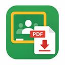

# Classroom PDF Saver



Google Classroom の資料を一覧から選んで、好きなフォルダにまとめて保存する Chrome 拡張機能です。

## 主な機能

- 開いている Classroom のページから、Drive のファイルや Google ドキュメント類の資料を一覧表示
- チェックした資料を、選んだフォルダに直接保存（ダウンロードフォルダを経由しない）
- Google ドキュメント / スプレッドシート / スライド / 図形は PDF に変換して保存
- 授業ごとに前回の保存先を記憶
- 保存済みの資料には「保存済み」と表示し、最初はチェックを外しておく
- パスワード付き PDF は、パスワードを入力すれば鍵を外して保存できる

## インストール

Chrome ウェブストアには公開していないため、開発者モードで読み込みます。

1. このリポジトリを `git clone` するか、ZIP でダウンロードして展開する
2. Chrome で `chrome://extensions` を開き、右上の「デベロッパー モード」をオンにする
3. 「パッケージ化されていない拡張機能を読み込む」で、展開したフォルダを選ぶ

保存先フォルダの指定に File System Access API を使っているため、Google Chrome などの Chromium 系ブラウザが必要です（Firefox は非対応）。

## 使い方

1. Classroom の授業ページ（「授業」タブや投稿の詳細ページなど）を開く
2. ツールバーの拡張機能アイコンをクリックする
3. 初回は「＋」から保存先フォルダを追加する
4. 保存したい資料にチェックを入れて「保存」を押す

フォルダへの書き込み許可を求められたら「毎回許可する」を選ぶと、次回から確認が出なくなります。
⚙ ボタンの管理ページから、保存先フォルダ・保存履歴・記憶したパスワードの確認と削除ができます。

### パスワード付き PDF

パスワードが必要な PDF があると、ポップアップ内に入力欄が出ます。

- 「鍵を外して保存」: 鍵を外した PDF を保存します（印刷・コピーの制限も外れます）
- 「鍵付きのまま保存」: ダウンロードしたままの PDF を保存します
- 「スキップ」: 保存せずに次へ進みます（チェックが残るので、後でもう一度保存できます）

一度入力したパスワードは、同じ保存操作の中の他のファイルにも自動で使います。
「この授業のパスワードとして記憶する」にチェックすると、次回からは入力不要になります。

ポップアップは、ページ側をクリックすると閉じてしまいます。投稿に書かれたパスワードを使うときは、先にコピーしてからポップアップを開いてください。

印刷・コピーの制限だけがかかっていて、パスワードなしで開ける PDF は、何も変えずにそのまま保存します。

## プライバシーとセキュリティ

- **通信先は Google だけです。** 資料を取得するため、Classroom・Drive・Google ドキュメントに、ブラウザでログイン中のアカウントとしてアクセスします。それ以外のサーバーへの送信や、利用状況の収集は一切しません。
- **PDF の鍵の解除はブラウザ内で行います。** PDF もパスワードも外部には送りません。
- **保存するデータはすべてこの PC のブラウザ内にあり、Google アカウントには同期しません。** 拡張機能を削除すると一緒に消えます。

| データ | 保存場所 | 内容 |
| --- | --- | --- |
| 保存先フォルダ | IndexedDB | フォルダへのアクセス権（フォルダ名のみ表示されます） |
| 保存履歴 | chrome.storage.local | ファイル名・授業名・保存先・日時（最大 500 件） |
| 授業ごとの設定 | chrome.storage.local | 授業名と、前回使った保存先 |
| 記憶したパスワード | chrome.storage.local | 「記憶する」を選んだときだけ。授業ごとに 1 つ |

記憶したパスワードは**暗号化されずに**ブラウザのプロファイル内に保存されます。拡張機能の中で暗号化しても鍵を同じ場所に置くしかなく、実質的な保護にならないためです。共用のパソコンでは記憶しないでください。

### 権限

| 権限 | 用途 |
| --- | --- |
| `activeTab`, `scripting` | ポップアップを開いたときに、表示中のページから資料のリンクを読み取る |
| `storage` | 保存履歴や設定を保存する |
| `classroom.google.com` など Google のドメイン | 資料ファイルを取得する |

manifest の CSP にある `'wasm-unsafe-eval'` は、PDF の鍵を外す qpdf（WebAssembly）を動かすためのものです。許可しているのは WebAssembly の実行だけで、JavaScript の `eval` や外部スクリプトの読み込みは許可していません。

## ファイル構成

```
manifest.json
popup.html / popup.js / popup.css     ポップアップ
manage.html / manage.js / manage.css  管理ページ
lib/scan.js       ページから資料のリンクを集める（ページ内で実行）
lib/download.js   Drive / Google ドキュメントからの取得とフォルダへの書き込み
lib/unlock.js     パスワード付き PDF の判定と解除
lib/store.js      保存先フォルダ・履歴・設定・パスワードの保存
vendor/qpdf/      qpdf の WebAssembly 版（同梱ライブラリ）
```

## ライセンス

[MIT License](LICENSE)

`vendor/qpdf/` 以下は MIT License の対象外です。同梱している [qpdf](https://github.com/qpdf/qpdf) は Apache License 2.0 で提供されています。
qpdf.wasm に含まれる libjpeg-turbo・zlib のライセンスも含めて、詳しくは [vendor/qpdf/README.md](vendor/qpdf/README.md) を参照してください。

---

Google Classroom、Google ドライブ、Google ドキュメントは Google LLC の商標です。
この拡張機能は Google とは関係のない非公式のツールです。資料の扱いは、学校や先生のルールに従ってください。
